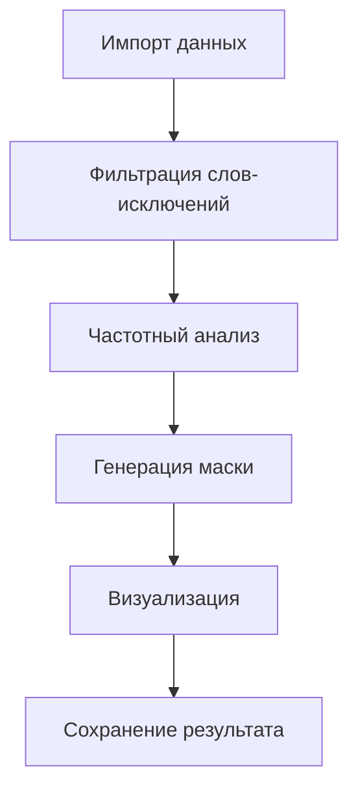

# Telegram Chat Word Cloud Generator 
Анализ частоты слов в Telegram-чатах с визуализацией в виде облака слов

[](https://www.python.org/downloads/)

## 📦 Установка
```bash
git clone https://github.com/Manshooo/telegram-wordcloud.git
cd telegram-wordcloud
pip install -r requirements.txt
```

## 🚀 Быстрый старт
1. Экспортируйте данные из Telegram (инструкция ниже)
2. Запустите скрипт:
```bash
# result.json по умолчанию от 
python run.py result.json
```

Результат сохранится как `имя_чата-wc.png`

## 🔧 Основные параметры
| Категория  | Параметры                                              |
| ---------- | ------------------------------------------------------ |
| Форма      | `--shape circle`, `--size 800x600`, `--width/--height` |
| Стиль      | `--bg-color`, `--monochrome`, `--config файл.json`     |
| Вывод      | `-o путь/файл.png`, `--no-overwrite`                   |
| Фильтрация | `--exclude "слова,через,запятую"`                      |

## 🎨 Расширенные настройки
### Цветовые конфигурации
Создайте `.wc` файл для кастомизации палитр:
```json
{
  "color_palettes": {
    "light_background": ["#2D4261", "#4A1D32"],
    "dark_background": ["#D6E4F0", "#F5D6E4"]
  }
}
```

Пример использования:
```bash
python run.py data.json --config custom-colors.json
```

### Режимы отображения
- **Автоцвета** (по умолчанию): интеллектуальный подбор контрастных оттенков
- **Монохромный**: `--monochrome` для черно-белой схемы
- **Кастомный фон**: `--bg-color "lightblue"` или `#AABBCC`

## 📋 Примеры использования
### Базовые
```bash
# Анализ группового чата
python run.py export.json "Рабочая группа" --shape circle

# Сохранение в каталог results
python run.py data.json -o results/cloud.png
```

### Продвинутые
```bash
# Темная тема с кастомной палитрой
python run.py chat.json --bg-color "#2A2F33" --config dark-palette.json

# Исключение служебных слов
python run.py data.json --exclude "вот,этот,какой,такой"
```

### Полная информация
Для получения полной справки по использованию
```bash
python run.py -h
```

## 📌 Особенности
- Автоматическое определение целевого чата для файлов с одним диалогом
- Поддержка русского и английского языков
- Оптимизация для больших чатов (50k+ сообщений)
- Экспорт в PNG с настраиваемым разрешением

## 🛠 Техническая информация


## ❓ Частые вопросы
**Q: Как обрабатываются стикеры и медиафайлы?**<br>
A: Все не-текстовые сообщения автоматически игнорируются

**Q: Можно ли использовать свои шрифты?**<br>
A: Да, укажите путь к .ttf файлу через `--font`

**Q: Почему некоторые слова отображаются горизонтально?**<br>
A: Это контролируется параметром `prefer_horizontal` (по умолчанию 90%)

---

> 🔄 Проект развивается! [Предложить улучшение](https://github.com/manshooo/telegram-wordcloud/issues)
> 
> 🔄 Изначально форк проекта [paulin1C/telegram-export-analysis](https://github.com/paulin1C/telegram-export-analysis)
