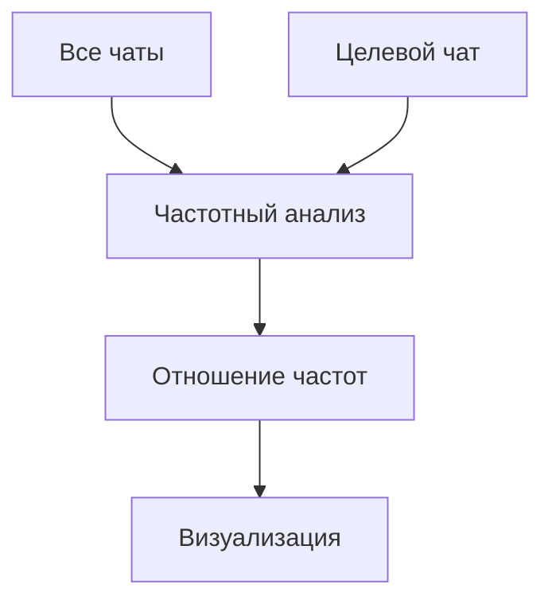

# Telegram Chat Word Cloud Generator 
Анализ частоты слов в Telegram-чатах с визуализацией в виде облака слов

[](https://www.python.org/downloads/)

## 📦 Установка
1. Клонируйте репозиторий:
```bash
git clone https://github.com/yourusername/telegram-wordcloud.git
cd telegram-wordcloud
```

2. Установите зависимости:
```bash
pip install -r requirements.txt
```

## 🚀 Быстрый старт
1. Экспортируйте данные из Telegram (см. раздел [Экспорт данных](#-экспорт-данных-из-telegram))
2. Запустите скрипт с вашим JSON-файлом:
```bash
python run.py result.json
```

Результат будет сохранен как `[имя_чата]-diff.png`

> 💡 Совет: Слова из других чатов используются как база для сравнения. Слова, характерные именно для этого чата, будут выделены крупнее.

## 📖 Использование
### Базовые команды
| Команда | Описание |
|---------|----------|
| `python run.py file.json` | Анализ основного/единственного чата в файле |
| `python run.py file.json "Имя чата"` | Анализ конкретного чата в многопользовательском файле |
| `python run.py file.json --shape circle` | Круглое облако слов |
| `python run.py file.json --size 800 600` | Кастомный размер изображения |

### 🎨 Параметры формы
| Параметр    | Значения по умолчанию | Описание                  |
|-------------|-----------------------|---------------------------|
| `--shape`   | rect                  | Форма: `circle` или `rect`|
| `--size`    | 1920x1080             | Размер в пикселях (ШxВ)   |
| `--font`    | system                | Путь к файлу шрифта       |

### Примеры
1. Прямоугольное облако стандартного размера:
```bash
python run.py chats.json "Рабочий чат"
```

2. Круглое облако 500x500 пикселей:
```bash
python run.py data.json --shape circle --size 500 500
```

## 📤 Экспорт данных из Telegram
### Через Telegram Desktop
1. Откройте настройки (Настройки > Продвинутые настройки)
2. Выберите "Экспорт данных Telegram"
3. Укажите параметры:
   - Тип экспорта: **Machine-readable JSON**
   - Выберите нужные типы чатов
4. Дождитесь получения `result.json`

### Для отдельного чата
1. В нужном чате откройте меню > "Экспорт истории чатов"
2. Формат: **JSON**
3. Сохраните полученный файл

## 🔍 Как это работает?
Алгоритм определяет характерные для конкретного чата слова путем сравнения с другими чатами:
1. Рассчитывает частоту слов во всех остальных чатах
2. Сравнивает с частотой в целевом чате
3. Увеличивает размер слов, которые встречаются в целевом чате чаще среднего



## ❓ Частые вопросы
### 🐛 Чат не находится в файле
- Убедитесь, что имя чата точно совпадает с экспортированным
- Для файлов с одним чатом не указывайте имя

### 📉 Мало слов в облаке
- Попробуйте увеличить `--size`
- Увеличьте значение `--max-words` в коде

### 🖼️ Форма не применяется
- Для круга (`circle`) используйте квадратные размеры (напр. 800x800)

## 📄 Лицензия
Проект распространяется под лицензией MIT. Подробности см. в файле [LICENSE](LICENSE).

---


> 🔄 Форк проекта [paulin1C/telegram-export-analysis](https://github.com/paulin1C/telegram-export-analysis) 
